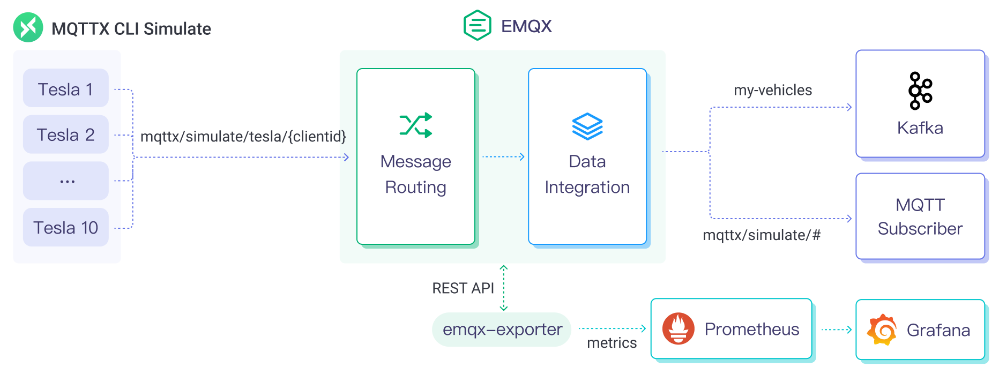

# mqtt-to-kafka

Streaming IoT data into Confluent/Kafka using MQTT and EMQX | MQTT Kafka Integration.

## Introduction

Kafka and MQTT are complementary technologies that enable end-to-end integration of IoT data. By integrating Kafka and MQTT, businesses can establish a robust IoT architecture that guarantees reliable connectivity and efficient data exchange between devices and IoT platforms. At the same time, it also facilitates high throughput real-time data processing and analysis throughout the entire IoT system.

There are many IoT use cases where integrating MQTT and Kafka provides significant value, such as Connected Cars and Telematics, Smart City Infrastructure, Industrial IoT Monitoring, Logistics Management, etc.

This is a demo project that shows how to use EMQX and Kafka to build a streaming data pipeline. The project uses MQTTX CLI to simulate the MQTT client to publish vehicle data to EMQX, and then uses EMQX Data Integration to streaming the data to Kafka.

## Architecture



| Name      | Version | Description                                                                      |
| --------- | ------- | -------------------------------------------------------------------------------- |
| [EMQX Enterprise](https://www.emqx.com/en/products/emqx)      | 5.0.4+  | MQTT broker used for message exchange between MQTT clients and the Kafka system. |
| [MQTTX CLI](https://mqttx.app/cli) | 1.9.3+  | Command-line tool used to generate simulated data for testing.        |
| [Kafka](https://kafka.apache.org/)     | 2.8.0+  | Distributed streaming platform for collecting, storing, and processing data.     |
| [EMQX Exporter](https://github.com/emqx/emqx-exporter)      | 0.1 | Prometheus exporter for EMQX |
| [Prometheus](https://prometheus.io/)   | v2.44.0  | Open-source systems monitoring and alerting toolkit.       |
| [Grafana](https://grafana.com/)   | 9.5.1+  | Visualization platform utilized to display and analyze the collected data.       |

Note: In this project we refer to [kafka-docker](https://github.com/wurstmeister/kafka-docker).

## How to use

1. Init the submodule to get the EMQX Exporter  (Optional):

  ```bash
  git submodule init
  git submodule update
  ```

2. Please make sure you have installed the [docker](https://www.docker.com/), and then running the following commands to start the demo:

  ```bash
  docker-compose up -d
  ```

  > You can quickly init submodule and start the demo by using the `make` command as well.

3. Running the following commands to see the message from MQTTX:

  ```bash
  docker logs -f mqttx
  ```

4. Running the following commands to see the message from kafka consumer:

  ```bash
  docker exec -it kafka \
    kafka-console-consumer.sh \
    --topic my-vehicles \
    --from-beginning \
    --bootstrap-server localhost:9092
  ```

  You can see the message from Kafka consumer:

  ```json
  {"vin":"EDF226K7LZTZ51222","speed":39,"odometer":68234,"soc":87,"elevation":4737,"heading":33,"accuracy":24,"power":97,"shift_state":"D","range":64,"est_battery_range":307,"gps_as_of":1681704127537,"location":{"latitude":"83.3494","longitude":"141.9851"},"timestamp":1681704127537}
  ```

5. If you want to view the EMQX Metrics in Grafana dashboard, you can open <http://localhost:3000> in your browser, and login with `admin:public`.

## License

[Apache License 2.0](./LICENSE)
